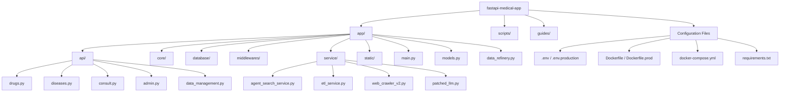

# Cấu Trúc Thư Mục `fastapi-medical-app`

Dưới đây là sơ đồ cấu trúc thư mục của dự án, bao gồm mô tả ngắn gọn cho các thành phần chính.

## Chi Tiết Các Thư Mục

### 1. `app/` - Mã Nguồn Chính

Chứa toàn bộ mã nguồn của ứng dụng FastAPI.

- **`main.py`**: Điểm khởi chạy của ứng dụng (Entry point), định nghĩa FastAPI app và các cấu hình cơ bản.
- **`models.py`**: Định nghĩa các Pydantic models và cấu trúc dữ liệu dùng chung.
- **`data_refinery.py`**: Module xử lý, làm sạch và chuẩn hóa dữ liệu.
- **`utils.py`**: Các hàm tiện ích dùng chung.
- **`services.py`**: (Deprecated/Legacy) Các logic nghiệp vụ cũ, đang dần chuyển sang thư mục `service/`.

#### `api/` - Các Endpoints

Định nghĩa các routes (API endpoints) được chia theo chức năng:

- `drugs.py`: API liên quan đến tra cứu thuốc.
- `diseases.py`: API liên quan đến mã bệnh (ICD).
- `consult.py`: API tư vấn, chatbot.
- `admin.py`: API dành cho quản trị viên.
- `data_management.py`: API quản lý dữ liệu hệ thống.
- `analysis.py`: API phân tích dữ liệu.

#### `core/` - Logic Cốt Lõi

- `classification.py`: Logic phân loại cốt lõi (ví dụ: phân loại thuốc/bệnh).
- `token_tracker.py`: Theo dõi usage token của LLM.

#### `database/` - Dữ liệu và Lưu trữ

Chứa file database SQLite và các công cụ liên quan đến dữ liệu thô.

- `medical.db`: Database chính (SQLite).
- Các file dữ liệu thô (Excel, CSV) dùng cho việc import/export.
- Các script tiện ích nhỏ (`split_chi_dinh_drugs.py`, `llm_summarize_chi_dinh.py`) để xử lý dữ liệu tại chỗ.

#### `middlewares/` - Middleware

- `logging_middleware.py`: Middleware ghi log request/response.

#### `service/` - Logic Nghiệp Vụ (Business Logic)

Nơi chứa các logic xử lý phức tạp, tách biệt khỏi API layer.

- `agent_search_service.py`: Service tìm kiếm thông minh tích hợp Agent.
- `web_crawler_v2.py` / `crawler/`: Hệ thống thu thập dữ liệu (Crawling).
- `etl_service.py`: Xử lý ETL (Extract - Transform - Load).
- `patched_llm.py`: Wrapper hoặc bản vá cho LLM client.
- `playwright_manager.py`: Quản lý trình duyệt Playwright cho crawler.
- `search_normalizer.py`: Chuẩn hóa từ khóa tìm kiếm.

#### `static/` - File Tĩnh

- `index.html`: Frontend đơn giản hoặc trang chủ mặc định.
- `allowed_charset.xlsx`: File cấu hình cho phép các ký tự đặc biệt.

### 2. `scripts/` - Công Cụ & Kiểm Thử

Chứa các script độc lập để chạy task, kiểm thử, hoặc debug.

- Các file `test_*.py`: Script kiểm thử thủ công hoặc tự động.
- Các file `debug_*.py`: Script hỗ trợ debug các module cụ thể (selectors, api...).
- `migrate_to_sqlite.py`, `run_import_datacore.py`: Script migrate hoặc import dữ liệu đặc thù.

### 3. Root Files - Cấu Hình & Triển Khai

- **`.env`, `.env.production`**: Biến môi trường.
- **`Dockerfile`, `Dockerfile.prod`**: Cấu hình build Docker image.
- **`docker-compose.yml`**: Cấu hình chạy/orchestrate các container (App, DB...).
- **`requirements.txt`**: Danh sách thư viện Python phụ thuộc.

---

*Tài liệu này được cập nhật tự động dựa trên cấu trúc thư mục hiện tại.*
