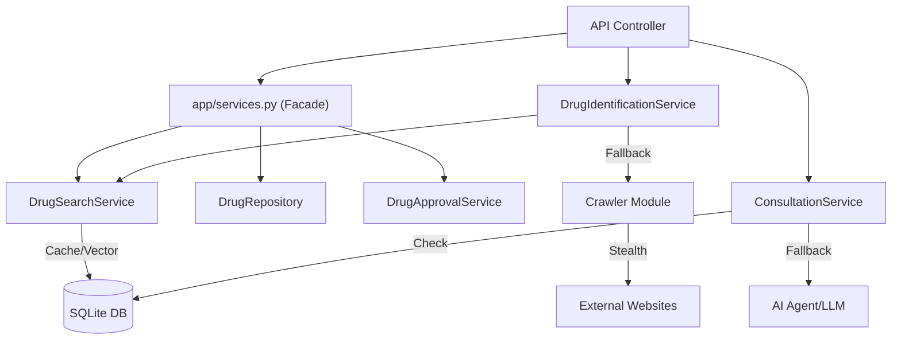

# 11. Service Layer Structure Detail

Tài liệu này mô tả chi tiết cấu trúc, vai trò, input/output của các thành phần trong thư mục `app/service/`. Đây là lớp logic nghiệp vụ cốt lõi (Business Logic Layer) của hệ thống Medical API.

## Tổng quan
Thư mục `app/service/` tuân thủ nguyên tắc **"Thin Controller, Fat Service"**. Mọi logic phức tạp, truy vấn DB, gọi AI, hoặc xử lý dữ liệu đều nằm ở đây. API Controller chỉ đóng vai trò nhận request và gọi Service.

---

## 1. `etl_service.py` (ETL Service)
**Vai trò**: Chịu trách nhiệm Extract-Transform-Load dữ liệu từ các nguồn bên ngoài (CSV, Crawler) vào Database. Xử lý làm sạch, chuẩn hóa và khử trùng lặp dữ liệu.

### Class: `EtlService`
| Hàm | Input | Output | Mô tả |
| :--- | :--- | :--- | :--- |
| `clean_and_deduplicate` | `df: pd.DataFrame` | `pd.DataFrame` | Làm sạch dữ liệu thô, loại bỏ dòng trống, chuẩn hóa cột, khử trùng lặp dựa trên Số Đăng Ký (SDK) hoặc Tên thuốc. |
| `process_for_import` | `df: pd.DataFrame` | `List[Dict]` | Chuyển đổi DataFrame thành danh sách dictionary chuẩn để insert vào DB. |
| `load_csv` | `file_path: str` | `pd.DataFrame` | Đọc file CSV với các thiết lập an toàn (skip bad lines, dtype=str). |

---

## 2. `drug_search_service.py` (Search Service)
**Vai trò**: Cung cấp khả năng tìm kiếm thuốc thông minh, kết hợp nhiều thuật toán: Tìm kiếm chính xác (Exact), tìm kiếm mờ (Fuzzy/RapidFuzz), và tìm kiếm vector (TF-IDF/Semantic).

### Class: `DrugSearchService`
| Hàm | Input | Output | Mô tả |
| :--- | :--- | :--- | :--- |
| `search_drug_smart` | `query_name: str` | `Dict` (Data + Confidence) | Tìm kiếm đa tầng (Multistage): 1. Exact Match (100%) 2. Partial SQL (95%) 3. Fuzzy Match (88%) 4. Vector Search (90%) |
| `_load_vector_cache` | None | None | Load toàn bộ tên thuốc đã verify vào RAM và huấn luyện TF-IDF vectorizer (Lazy loading). |
| `search` (Legacy) | `query: str` | `Dict` | Tìm kiếm full-text đơn giản (FTS) phục vụ autocomplete. |

---

## 3. `drug_identification_service.py` (Identification Service)
**Vai trò**: Xác định thông tin thuốc từ một chuỗi nhập liệu thô (ví dụ: từ đơn thuốc OCR hoặc input người dùng). Nó phối hợp giữa DB Search và Web Crawler.

### Class: `DrugIdentificationService`
| Hàm | Input | Output | Mô tả |
| :--- | :--- | :--- | :--- |
| `process_batch` | `drug_names: List[str]` | `List[Dict]` | Xử lý một danh sách tên thuốc song song. Phát hiện trùng lặp trong batch. |
| `identify_drug` | `drug_raw: str` | `Dict` | Quy trình định danh: 1. Chuẩn hóa tên. 2. Gọi `DrugSearchService` tìm trong DB. 3. Nếu DB không có hoặc không chắc chắn -> Gọi Crawler (`scrape_drug_web`). |

---

## 4. `drug_approval_service.py` (Approval Service)
**Vai trò**: Quản lý quy trình duyệt thuốc (Staging Area). Xử lý xung đột dữ liệu khi import hoặc crawler tìm thấy thuốc mới trùng tên/SDK với thuốc cũ.

### Class: `DrugApprovalService`
| Hàm | Input | Output | Mô tả |
| :--- | :--- | :--- | :--- |
| `save_verified_drug` | `drug_data: Dict` | `Dict` (Status) | Lưu thuốc mới. Nếu phát hiện trùng lặp (SDK/Tên) -> Lưu vào bảng `drug_staging` (chờ duyệt) thay vì `drugs`. |
| `get_pending_stagings` | None | `List[Dict]` | Lấy danh sách các thuốc đang chờ duyệt. Kèm thông tin thuốc gốc đang bị xung đột. |
| `approve_staging` | `staging_id`, `user` | `Dict` | Duyệt thuốc: Merge thông tin mới vào thuốc cũ (Update) hoặc tạo mới (Insert). Lưu lịch sử thay đổi. |
| `reject_staging` | `staging_id`, `user` | `Dict` | Từ chối thuốc: Xóa khỏi staging và lưu log lịch sử. |

---

## 5. `consultation_service.py` (Consultation Service)
**Vai trò**: Kiểm tra tương tác thuốc - bệnh (ICD). Kết hợp Rule-based (Knowledge Base nội bộ) và AI Fallback.

### Class: `ConsultationService`
| Hàm | Input | Output | Mô tả |
| :--- | :--- | :--- | :--- |
| `check_knowledge_base` | `drug`, `disease`, `type` | `Optional[Dict]` | Tra cứu bảng `knowledge_base` để xem thuốc này có từng được dùng cho bệnh này không (dựa trên tần suất). |
| `consult_integrated` | `items`, `diagnoses` | `List[Result]` | Hàm chính:  1. Duyệt qua từng thuốc. 2. Check KB nội bộ. 3. Nếu KB không có -> Gom lại gọi AI (`_call_ai_fallback`). |
| `_call_ai_fallback` | `drugs`, `diagnoses` | `List[Result]` | (Internal) Gọi AI Model để phân tích dược lý khi dữ liệu nội bộ không đủ. |

---

## 6. `agent_search_service.py` (AI Agent Search)
**Vai trò**: AI Agent tự động duyệt web thông minh để tìm thông tin thuốc khi các phương pháp crawler truyền thống thất bại. Sử dụng mô hình `ReAct` (Reason-Act).

### Các hàm chính
| Hàm | Input | Output | Mô tả |
| :--- | :--- | :--- | :--- |
| `run_agent_search` | `drug_name: str` | `Dict` | Khởi chạy vòng lặp Agent (Max 5 rounds): 1. LLM plan hành động (Navigate/Answer). 2. Playwright thực thi (Click/Read DOM). 3. Trả về kết quả JSON struct. |

---

## 7. `drug_repo.py` (Data Access Layer)
**Vai trò**: Lớp truy cập dữ liệu thuần túy (Repository Pattern), giúp tách biệt câu lệnh SQL khỏi logic nghiệp vụ.

### Class: `DrugRepository`
| Hàm | Input | Output | Mô tả |
| :--- | :--- | :--- | :--- |
| `get_drug_by_id` | `row_id` | `Dict` | Lấy chi tiết thuốc theo ID. |
| `get_all_drugs` | `page`, `limit`, `search` | `Dict` (List + Total) | Lấy danh sách thuốc, hỗ trợ phân trang và tìm kiếm cơ bản. |

---

## 8. Module `app/service/crawler/`
**Vai trò**: Hệ thống crawler phức tạp, hỗ trợ đa luồng, đa website và module hóa các bộ trích xuất (Extractors).

### Cấu trúc file
*   **`main.py`**: Entry point (`scrape_drug_web_advanced`). Điều phối luồng chạy song song trên nhiều site.
*   **`config.py`**: Chứa cấu hình CSS Selectors/XPath cho từng trang (ThuocBietDuoc, TrungTamThuoc, LongChau...).
*   **`search_engines.py`**: Module tìm kiếm Google/Bing/DuckDuckGo giả lập hành vi người dùng (Human-like behavior) để vượt qua chặn bot.
*   **`extractors.py`**: Logic bóc tách dữ liệu cụ thể từ HTML.
*   **`stealth_config.py`**: Cấu hình Playwright Stealth để ẩn danh tính bot.

### Flow hoạt động (Crawler)
1.  **Input**: Tên thuốc.
2.  **Google Search** (Optional): Tìm URL trực tiếp của thuốc trên các trang uy tín.
3.  **Parallel Scraping**: Mở trình duyệt, truy cập đồng thời vào các trang cấu hình (hoặc URL tìm được).
4.  **Parsing**: Dùng Selectors trong `config.py` để lấy dữ liệu (SDK, Hoạt chất, Chỉ định...).
5.  **Merge**: Gộp kết quả từ nhiều nguồn, chọn kết quả tốt nhất (có SDK, nhiều trường thông tin nhất).

---

## Sơ đồ luồng dữ liệu (Data Flow)

