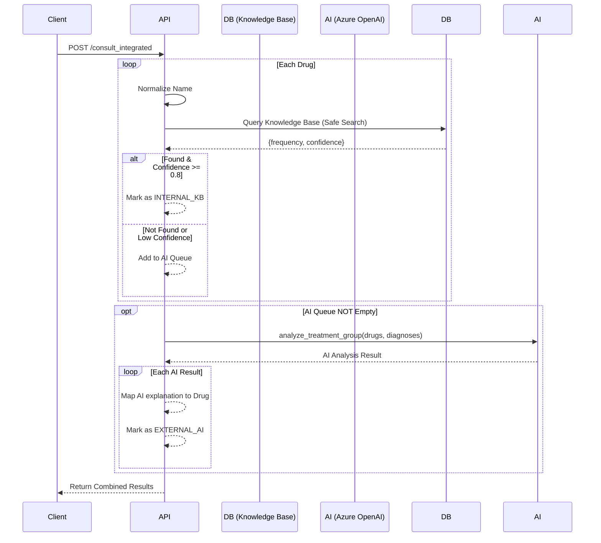

# API Specifications - Consult Integrated

## Base URL
```
http://localhost:8000/api/v1
```

---

## 1. Consult API (`/consult/consult_integrated`)

### 1.1 POST `/consult/consult_integrated`
**Mô tả**: Endpoint tư vấn "Hybrid" thông minh. Kết hợp tốc độ của **Internal Knowledge Base** (đã được kiểm chứng) và sự linh hoạt của **Generative AI** (Azure OpenAI) để phân tích sự phù hợp giữa thuốc và bệnh.

**Request:**
```json
{
  "request_id": "REQ-2024-001",
  "items": [
    {"id": "drug_01", "name": "Paracetamol 500mg"},
    {"id": "drug_02", "name": "Unknown Drug X"}
  ],
  "diagnoses": [
    {"code": "R51", "name": "Đau đầu", "type": "MAIN"},
    {"code": "J00", "name": "Cảm lạnh", "type": "SECONDARY"}
  ],
  "symptom": "Bệnh nhân kêu đau đầu dữ dội"
}
```

**Response:**
```json
{
  "results": [
    {
      "id": "drug_01",
      "name": "Paracetamol 500mg",
      "category": "drug",
      "validity": "valid",
      "role": "main drug",
      "explanation": "Internal KB: Used 150 times for 'Đau đầu'. Confidence: 92%",
      "source": "INTERNAL_KB"
    },
    {
      "id": "drug_02",
      "name": "Unknown Drug X",
      "category": "drug",
      "validity": "unknown",
      "role": "unknown",
      "explanation": "AI System: Không tìm thấy thông tin rõ ràng về thuốc này trong ngữ cảnh bệnh.",
      "source": "EXTERNAL_AI_FALLBACK"
    }
  ]
}
```

---

## 2. Processing Flow



---

## 3. Data Fields

### 3.1 Input Object
| Field | Type | Required | Mô tả |
|-------|------|----------|-------|
| `request_id` | str | Yes | ID định danh request để tracking/logging |
| `items` | List[DrugItem] | Yes | Danh sách thuốc trong đơn |
| `diagnoses` | List[Diagnosis] | Yes | Danh sách chẩn đoán (Main/Secondary) |
| `symptom` | str | No | Triệu chứng lâm sàng bổ sung |

### 3.2 Output Object (ConsultResult)
| Field | Type | Mô tả |
|-------|------|-------|
| `id` | str | ID gốc từ request item |
| `name` | str | Tên thuốc |
| `validity` | str | `valid` (hợp lý), `invalid` (sai), `unknown` |
| `role` | str | Vai trò thuốc: `main drug`, `supportive`, `antibiotic`... |
| `explanation` | str | Lý do (từ KB hoặc AI) |
| `source` | str | Nguồn quyết định: `INTERNAL_KB` hay `EXTERNAL_AI` |

---

## 4. Logic Details

### 4.1 Knowledge Base Lookup Strategy
Hệ thống ưu tiên tra cứu dữ liệu nội bộ để đảm bảo tốc độ (<50ms) và tính nhất quán.
- **Input**: Normalized Drug Name + Normalized Disease Name.
- **Query**: `SELECT * FROM knowledge_base WHERE drug=? AND disease=?`
- **Threshold**: Chỉ chấp nhận kết quả nếu `confidence_score >= 0.8`.
    - `0.8` tương đương với cặp thuốc-bệnh đã xuất hiện và được kiểm chứng khoảng 100 lần.

### 4.2 AI Fallback Strategy
Khi KB không có data (thuốc mới, bệnh hiếm), hệ thống gọi Azure OpenAI (GPT-4o-mini).
- **Batch Processing**: Gom tất cả thuốc chưa rõ vào 1 prompt để tiết kiệm token.
- **Prompt Engineering**: Yêu cầu AI xác định vai trò của từng thuốc đối với tập hợp bệnh được cung cấp.

---

## 5. Use Cases

### 5.1 Real-time Clinical Decision Support (CDSS)
Tích hợp vào phần mềm kê đơn bác sĩ. Khi bác sĩ gõ thuốc, hệ thống check ngay lập tức:
- Nếu là thuốc phổ biến (vd: Paracetamol - Đau đầu) -> KB trả về "Hợp lý" ngay lập tức (Green tick).
- Nếu là thuốc lạ/kê sai -> AI phân tích và cảnh báo (Yellow/Red alert).

### 5.2 Automated Claim Review (Bảo hiểm)
Duyệt tự động hồ sơ bồi thường:
- 80% hồ sơ thông thường được duyệt bởi KB (High confidence).
- 20% hồ sơ phức tạp được chuyển sang AI review hoặc người duyệt.

---

*Last Updated: 2026-01-14*
