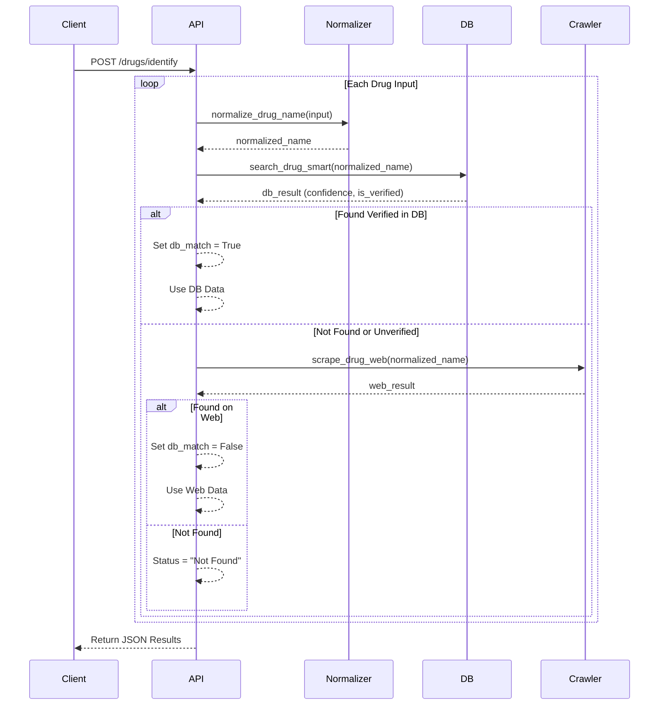

# API Specifications - Identify Drugs

## Base URL
```
http://localhost:8000/api/v1
```

---

## 1. Identify API (`/drugs/identify`)

### 1.1 POST `/drugs/identify`
**Mô tả**: Endpoint quan trọng nhất để xác định danh tính thuốc từ input thô. Hệ thống sử dụng chiến lược **Smart Search**: Check Database (Verified) trước -> Nếu không có -> Fallback sang Web Search (Crawler).

**Request:**
```json
{
  "drugs": [
    "Paracetamol 500mg", 
    "Ludox - 200mg", 
    "Thuốc lạ XYZ"
  ]
}
```

**Response:**
```json
{
  "results": [
    {
      "input_name": "Paracetamol 500mg",
      "db_match": true,
      "official_name": "Paracetamol",
      "sdk": "VN-12345-22",
      "active_ingredient": "Paracetamol",
      "usage": "Giảm đau, hạ sốt",
      "classification": "OTC",
      "source": "Database",
      "confidence": 1.0
    },
    {
      "input_name": "Ludox - 200mg",
      "db_match": false,
      "official_name": "Ludox",
      "sdk": "VN-5145-16",
      "active_ingredient": "Amisulpride",
      "usage": "Điều trị tâm thần phân liệt",
      "classification": "ETC",
      "source": "Web",
      "confidence": 0.8
    },
    {
      "input_name": "Thuốc lạ XYZ",
      "status": "Not Found"
    }
  ]
}
```

---

## 2. Processing Flow



---

## 3. Data Fields

### 3.1 Input
| Field | Type | Required | Mô tả |
|-------|------|----------|-------|
| `drugs` | List[str] | Yes | Danh sách tên thuốc cần tra cứu. Support batch processing. |

### 3.2 Output Object
| Field | Type | Mô tả |
|-------|------|-------|
| `input_name` | str | Tên thuốc gốc từ request |
| `db_match` | boolean | `true` nếu tìm thấy trong DB (Verified), `false` nếu lấy từ Web |
| `official_name` | str | Tên thuốc chính thức (đã chuẩn hóa) |
| `sdk` | str | Số đăng ký (VN-..., VD-...) |
| `active_ingredient` | str | Hoạt chất chính |
| `usage` | str | Chỉ định / Công dụng |
| `classification` | str | Phân loại (ETC/OTC) |
| `source` | str | Nguồn dữ liệu ("Database" hoặc "Web") |
| `confidence` | float | Độ tin cậy (0.0 - 1.0) |

---

## 4. Logic Details

### 4.1 Normalization
Trước khi search, tên thuốc sẽ được chuẩn hóa:
- Loại bỏ hàm lượng (500mg, 10ml...)
- Loại bỏ dạng bào chế thừa (viên nén, dung dịch...)
- **Ví dụ**: "Panadol Extra - 500mg" -> "Panadol Extra"

### 4.2 Smart Search Strategy
1. **Database Check**: Tìm trong bảng `drugs` với Full-text search hoặc Vector search.
   - Điều kiện chấp nhận: `confidence > 0.9` VÀ `is_verified = 1`.
2. **Web Fallback**: Nếu DB không thỏa mãn, gọi `web_crawler` để search Google/Bing/Websites y dược.
   - Kết quả Web luôn có `db_match = false` và `confidence ≈ 0.8`.

---

## 5. Use Cases

### 5.1 Pre-processing for Analysis
Dùng làm bước đệm cho API `/analysis/treatment-analysis`. API này chuẩn hóa dữ liệu đầu vào để AI có context chính xác (SDK, hoạt chất) thay vì chỉ tên thương mại.

### 5.2 Drug Verification
Hỗ trợ dược sĩ kiểm tra nhanh xem thuốc có trong danh mục được duyệt (DB) hay là thuốc mới/lạ (Web).

---

*Last Updated: 2026-01-14*
