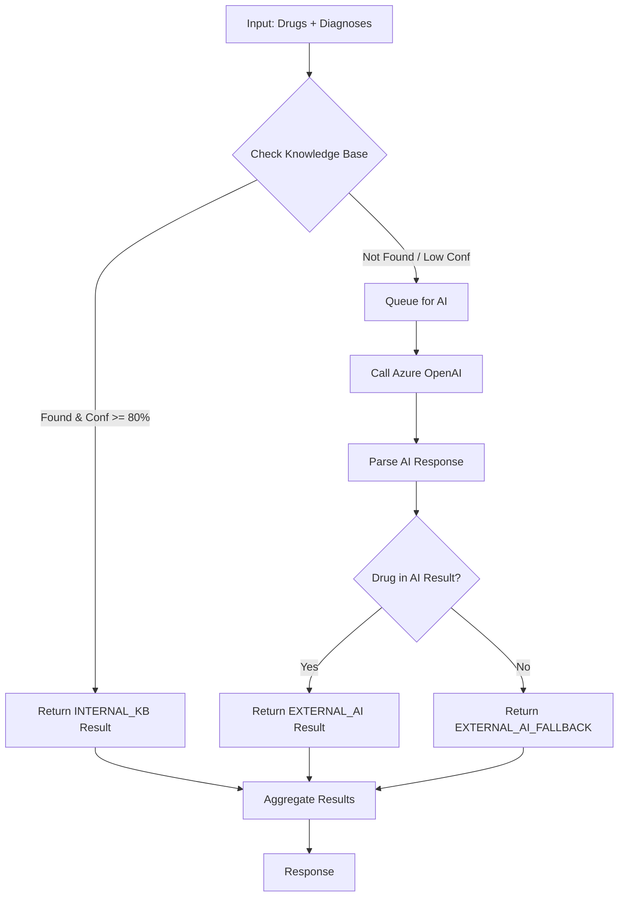
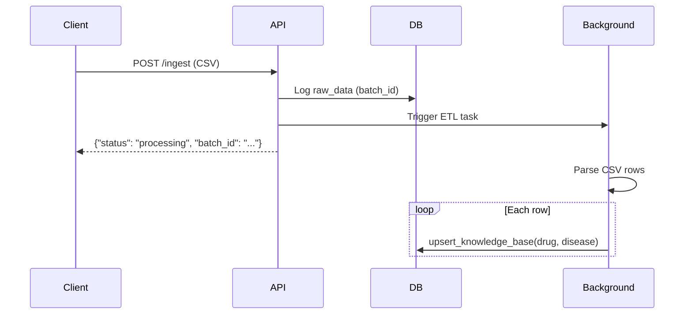

# API Specifications V2 - Consult & Data Management

## Base URL
```
http://localhost:8000/api/v1
```

---

## 1. Consult API (`/consult`)

### 1.1 POST `/consult/consult_integrated`
**Mô tả**: Hybrid Consultation - Kiểm tra mapping thuốc-bệnh sử dụng Internal KB + AI Fallback.

**Request:**
```json
{
  "request_id": "REQ-001",
  "items": [
    {"id": "drug1", "name": "Paracetamol 500mg"},
    {"id": "drug2", "name": "Amoxicillin 250mg"}
  ],
  "diagnoses": [
    {"code": "R51", "name": "Đau đầu", "type": "MAIN"},
    {"code": "J06.9", "name": "Nhiễm trùng đường hô hấp", "type": "SECONDARY"}
  ],
  "symptom": "Đau đầu kèm sốt nhẹ"
}
```

**Response:**
```json
{
  "results": [
    {
      "id": "drug1",
      "name": "Paracetamol 500mg",
      "category": "drug",
      "validity": "valid",
      "role": "main drug",
      "explanation": "Internal KB: Used 150 times for 'Đau đầu'. Confidence: 92%",
      "source": "INTERNAL_KB"
    },
    {
      "id": "drug2",
      "name": "Amoxicillin 250mg",
      "category": "drug",
      "validity": "valid",
      "role": "supportive",
      "explanation": "AI Suggestion: Phù hợp với nhiễm trùng đường hô hấp",
      "source": "EXTERNAL_AI"
    }
  ]
}
```

**Processing Flow:**


**Validity Values:**
| Value | Mô tả |
|-------|-------|
| `valid` | Thuốc phù hợp với bệnh |
| `invalid` | Thuốc không phù hợp |
| `unknown` | Không đủ thông tin |
| `error` | Lỗi hệ thống |

**Source Values:**
| Value | Mô tả |
|-------|-------|
| `INTERNAL_KB` | Từ Knowledge Base nội bộ |
| `EXTERNAL_AI` | Từ Azure OpenAI |
| `EXTERNAL_AI_FALLBACK` | AI không đề cập |
| `ERROR` | Lỗi khi gọi AI |

---

## 2. Data Management API (`/data`)

### 2.1 POST `/data/ingest`
**Mô tả**: ETL - Import CSV logs để xây dựng Knowledge Base.

**Request:** `multipart/form-data`
| Field | Type | Mô tả |
|-------|------|-------|
| file | File | CSV file với columns: `drug_name`, `disease_name`, `icd_code` (optional) |

**CSV Format:**
```csv
drug_name,disease_name,icd_code
Paracetamol,Đau đầu,R51
Amoxicillin,Viêm họng,J02.9
```

**Response:**
```json
{
  "status": "processing",
  "batch_id": "550e8400-e29b-41d4-a716-446655440000",
  "message": "File received and ETL started."
}
```

**ETL Process:**


**Errors:**
| Code | Mô tả |
|------|-------|
| 400 | Only CSV files are allowed |
| 500 | Server error khi xử lý file |

---

## 3. Knowledge Base Internals

### 3.1 Vote & Promote Algorithm

Khi một cặp (thuốc, bệnh) được thêm vào KB:
1. **Nếu đã tồn tại**: Tăng `frequency += 1`, cập nhật `confidence_score`
2. **Nếu mới**: Insert với `frequency = 1`, `confidence_score = 0.1`

**Confidence Formula:**
```python
confidence = min(0.99, log10(frequency) / 2.5)
# frequency=1   → confidence ≈ 0.0
# frequency=10  → confidence ≈ 0.4
# frequency=100 → confidence ≈ 0.8
# frequency=300 → confidence ≈ 0.99
```

---

*Last Updated: 2026-01-14*
