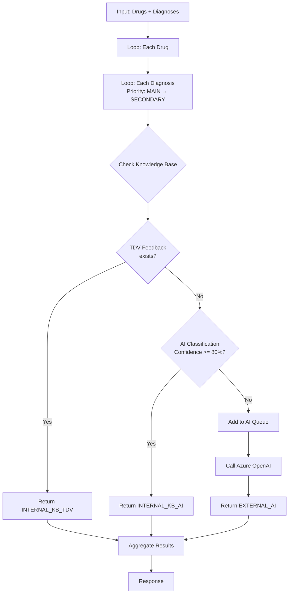
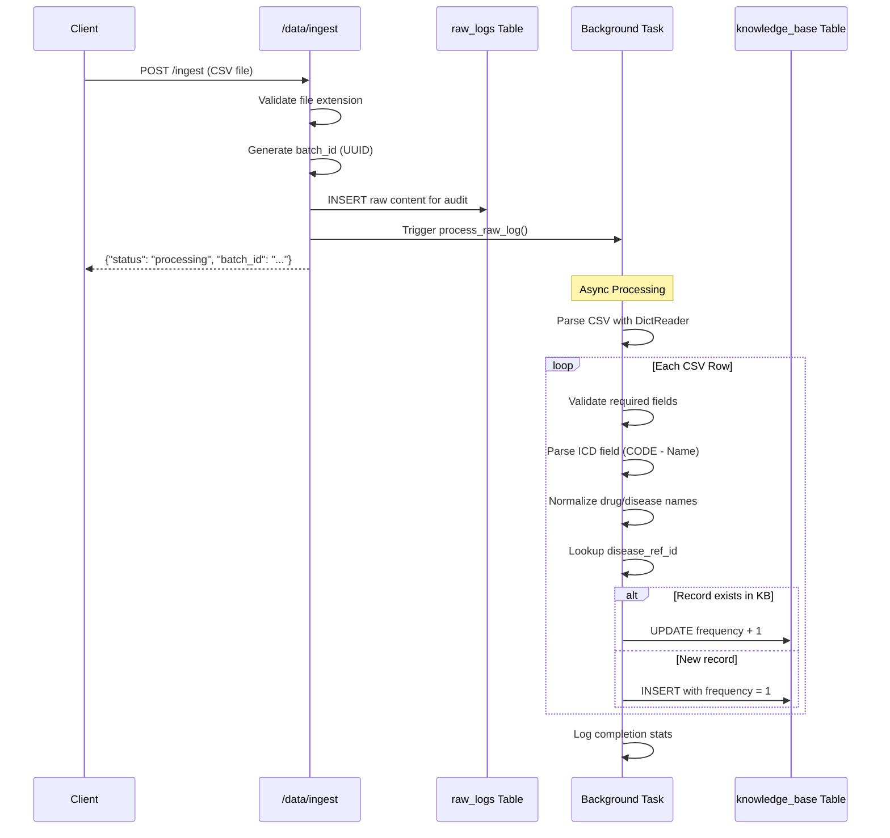

# API Specifications V2.1 - Consult & Data Management

## Base URL
```
http://localhost:8000/api/v1
```

---

## 1. Consult API (`/consult`)

### 1.1 POST `/consult_integrated`

**Mô tả**: Hybrid Consultation - Kiểm tra mapping thuốc-bệnh sử dụng Internal KB (với TDV Priority) + AI Fallback.

#### Request Schema

```json
{
  "request_id": "REQ-001",
  "items": [
    {"id": "drug1", "name": "Paracetamol 500mg"},
    {"id": "drug2", "name": "Amoxicillin 250mg"}
  ],
  "diagnoses": [
    {"code": "R51", "name": "Đau đầu", "type": "MAIN"},
    {"code": "J06.9", "name": "Nhiễm trùng đường hô hấp", "type": "SECONDARY"}
  ],
  "symptom": "Đau đầu kèm sốt nhẹ"
}
```

| Field | Type | Required | Mô tả |
|-------|------|----------|-------|
| `request_id` | string | ✅ | ID định danh request |
| `items` | array | ✅ | Danh sách thuốc cần kiểm tra |
| `items[].id` | string | ✅ | ID thuốc (từ client) |
| `items[].name` | string | ✅ | Tên thuốc |
| `diagnoses` | array | ✅ | Danh sách chẩn đoán |
| `diagnoses[].code` | string | ✅ | Mã ICD-10 |
| `diagnoses[].name` | string | ✅ | Tên bệnh |
| `diagnoses[].type` | string | ✅ | `MAIN` hoặc `SECONDARY` |
| `symptom` | string | ❌ | Triệu chứng bổ sung |

#### Response Schema

```json
{
  "results": [
    {
      "id": "drug1",
      "name": "Paracetamol 500mg",
      "category": "drug",
      "validity": "valid",
      "role": "Thuốc điều trị chính",
      "explanation": "Expert Verified: Classified as 'Thuốc điều trị chính' by Medical Reviewer.",
      "source": "INTERNAL_KB_TDV"
    },
    {
      "id": "drug2",
      "name": "Amoxicillin 250mg",
      "category": "drug",
      "validity": "valid",
      "role": "Thuốc hỗ trợ",
      "explanation": "Internal KB (AI): Found 85 records. Confidence: 88%",
      "source": "INTERNAL_KB_AI"
    }
  ]
}
```

| Field | Type | Mô tả |
|-------|------|-------|
| `id` | string | ID thuốc (từ request) |
| `name` | string | Tên thuốc |
| `category` | string | Luôn là `"drug"` |
| `validity` | string | Trạng thái hợp lệ (xem bảng dưới) |
| `role` | string | Vai trò điều trị (từ KB hoặc AI) |
| `explanation` | string | Giải thích chi tiết |
| `source` | string | Nguồn dữ liệu (xem bảng dưới) |

#### Processing Flow



#### Priority Logic (TDV First)

1. **TDV Feedback (Highest Priority)**: Nếu cặp (thuốc, bệnh) có `tdv_feedback` trong KB → Dùng ngay
2. **AI Classification**: Nếu không có TDV, kiểm tra `treatment_type` với confidence >= 80%
3. **External AI Fallback**: Gọi Azure OpenAI nếu KB không đủ tin cậy

#### Validity Values

| Value | Mô tả | Khi nào |
|-------|-------|---------|
| `valid` | Thuốc phù hợp với bệnh | KB match hoặc AI xác nhận |
| `invalid` | Thuốc không phù hợp | AI xác định không phù hợp |
| `unknown` | Không đủ thông tin | KB miss + AI không kết luận |
| `error` | Lỗi hệ thống | Exception khi xử lý |

#### Source Values

| Value | Mô tả | Priority |
|-------|-------|----------|
| `INTERNAL_KB_TDV` | Từ KB - Đã có feedback chuyên gia (TDV) | 1 (Cao nhất) |
| `INTERNAL_KB_AI` | Từ KB - AI classification với high confidence | 2 |
| `EXTERNAL_AI` | Từ Azure OpenAI | 3 |
| `ERROR` | Lỗi khi gọi AI | - |

#### Error Responses

| HTTP Code | Mô tả | Response |
|-----------|-------|----------|
| 400 | Invalid request body | `{"detail": "Validation error..."}` |
| 500 | Internal server error | `{"detail": "Error message"}` |

---

## 2. Data Management API (`/data`)

### 2.1 POST `/data/ingest`

**Mô tả**: ETL - Import CSV logs từ bệnh viện để xây dựng Knowledge Base.

#### Request

**Content-Type**: `multipart/form-data`

| Field | Type | Required | Mô tả |
|-------|------|----------|-------|
| `file` | File | ✅ | CSV file (.csv extension) |

#### CSV Format Specification (V2.0)

##### Required Columns

| Column Name | Format | Mô tả |
|-------------|--------|-------|
| `Tên thuốc` | Text | Tên thuốc đầy đủ |
| `Mã ICD (Chính)` | `CODE - Tên bệnh` | Bệnh chính. VD: `J00 - Viêm mũi họng cấp` |

##### Optional Columns

| Column Name | Format | Map to DB | Mô tả |
|-------------|--------|-----------|-------|
| `Bệnh phụ` | `CODE - Tên bệnh` | `secondary_disease_*` | Bệnh phụ/đi kèm |
| `Chẩn đoán ra viện` | Text tự do | `symptom` | Triệu chứng khi ra viện |
| `Phân loại` | Comma-separated | `treatment_type` | Phân loại từ AI. VD: `drug, main` |
| `Feedback` | Comma-separated | `tdv_feedback` | Feedback từ TDV. VD: `drug` |
| `Lý do kê đơn` | Text | `prescription_reason` | Lý do kê đơn thuốc |
| `Cách dùng` | - | ⏭️ Ignored | Không xử lý |
| `SL` | - | ⏭️ Ignored | Không xử lý |

##### Sample CSV

```csv
Tên thuốc,Mã ICD (Chính),Bệnh phụ,Phân loại,Feedback,Chẩn đoán ra viện,Lý do kê đơn
Paracetamol 500mg,R51 - Đau đầu,,"drug, main",drug,Nhức đầu kéo dài,Giảm đau hạ sốt
Amoxicillin 250mg,J02 - Viêm họng cấp,B97.4 - Vi rút hợp bào,"drug, support",,Viêm họng mủ,Kháng sinh điều trị
Omeprazole 20mg,K21 - Trào ngược dạ dày,,"drug, support",support,Đau thượng vị,Ức chế acid
```

#### Response

**Success (202 Accepted)**:
```json
{
  "status": "processing",
  "batch_id": "550e8400-e29b-41d4-a716-446655440000",
  "message": "File received and ETL started."
}
```

| Field | Type | Mô tả |
|-------|------|-------|
| `status` | string | Luôn là `"processing"` |
| `batch_id` | string | UUID của batch, dùng để trace |
| `message` | string | Thông báo |

#### ETL Process Sequence



#### Error Responses

| HTTP Code | Condition | Response |
|-----------|-----------|----------|
| 400 | File không phải .csv | `{"detail": "Only CSV files are allowed."}` |
| 400 | File rỗng | `{"detail": "Empty file"}` |
| 500 | Lỗi đọc/xử lý file | `{"detail": "Error message"}` |

---

## 3. Knowledge Base Internals

### 3.1 Database Schema (knowledge_base)

```sql
CREATE TABLE knowledge_base (
    id INTEGER PRIMARY KEY,
    -- Drug Info
    drug_name TEXT,              -- Tên gốc từ CSV
    drug_name_norm TEXT,         -- Chuẩn hóa (lowercase, no accents)
    drug_ref_id INTEGER,         -- FK → drugs.id
    -- Primary Disease
    disease_icd TEXT,            -- Mã ICD (lowercase)
    disease_name TEXT,           -- Tên bệnh gốc
    disease_name_norm TEXT,      -- Chuẩn hóa
    disease_ref_id INTEGER,      -- FK → diseases.id
    -- Secondary Disease
    secondary_disease_icd TEXT,
    secondary_disease_name TEXT,
    secondary_disease_name_norm TEXT,
    secondary_disease_ref_id INTEGER,
    -- Classification
    treatment_type TEXT,         -- AI classification
    tdv_feedback TEXT,           -- TDV feedback (PRIORITY)
    symptom TEXT,                -- Chẩn đoán ra viện
    prescription_reason TEXT,    -- Lý do kê đơn
    -- Metadata
    frequency INTEGER DEFAULT 1,
    confidence_score REAL DEFAULT 0.0,
    batch_id TEXT,
    last_updated TIMESTAMP
);
```

### 3.2 Vote & Promote Algorithm

**Khi một cặp (thuốc, bệnh) được thêm vào KB:**

1. **Check Existing**: Query by `(drug_name_norm, disease_icd)`
2. **If Exists**: 
   - `frequency += 1`
   - Recalculate `confidence_score`
   - Update `treatment_type` / `tdv_feedback` if provided
3. **If New**: Insert with `frequency = 1`

**Confidence Formula:**
```python
import math

def calculate_confidence(frequency: int) -> float:
    if frequency <= 1:
        return 0.1
    return min(0.99, math.log10(frequency) / 2.0)

# Examples:
# frequency=1   → confidence = 0.10
# frequency=10  → confidence = 0.50
# frequency=100 → confidence = 0.99
# frequency=300 → confidence = 0.99 (capped)
```

### 3.3 Consultation Query

```sql
SELECT 
    treatment_type, 
    tdv_feedback, 
    SUM(frequency) as total_freq,
    COUNT(*) as record_count
FROM knowledge_base 
WHERE drug_name_norm = ? AND disease_name_norm = ?
GROUP BY treatment_type, tdv_feedback
ORDER BY total_freq DESC
```

**Decision Logic:**
1. Iterate results
2. If `tdv_feedback` is non-empty → Return immediately (TDV Priority)
3. Else if `treatment_type` exists and `confidence >= 0.8` → Return AI classification
4. Else → Queue for External AI

---

## 4. Monitoring & Debugging

### 4.1 Tracing a Request

1. **Get batch_id** from `/data/ingest` response
2. **Query raw_logs**:
   ```sql
   SELECT * FROM raw_logs WHERE batch_id = ?
   ```
3. **Query knowledge_base**:
   ```sql
   SELECT * FROM knowledge_base WHERE batch_id = ?
   ```

### 4.2 Health Check

```bash
curl http://localhost:8000/api/v1/health
```

---

## Changelog

| Date | Version | Change |
|------|---------|--------|
| 2026-01-19 | 2.1.0 | Added TDV priority logic, expanded CSV columns, detailed schemas |
| 2026-01-16 | 2.0.0 | Added secondary disease, symptom, prescription_reason columns |
| 2026-01-14 | 1.0.0 | Initial specification |

---

*Last Updated: 2026-01-19*
