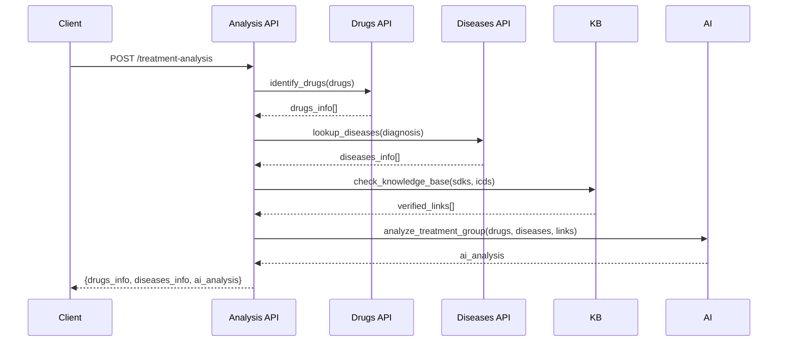

# API Specifications V3 - Treatment Analysis

## Base URL
```
http://localhost:8000/api/v1
```

---

## 1. Analysis API (`/analysis`)

### 1.1 POST `/analysis/treatment-analysis`
**Mô tả**: Phân tích toàn diện phác đồ điều trị sử dụng AI + Knowledge Base.

**Request:**
```json
{
  "drugs": ["Paracetamol 500mg", "Amoxicillin 250mg", "Vitamin C 1000mg"],
  "diagnosis": [
    {"name": "Đau đầu", "icd10": "R51"},
    {"name": "Nhiễm trùng đường hô hấp", "icd10": "J06.9"}
  ]
}
```

**Response:**
```json
{
  "drugs_info": [
    {
      "input_name": "Paracetamol 500mg",
      "db_match": true,
      "official_name": "Paracetamol",
      "sdk": "VN-12345-22",
      "active_ingredient": "Paracetamol",
      "source": "Database"
    },
    {
      "input_name": "Amoxicillin 250mg",
      "db_match": true,
      "official_name": "Amoxicillin",
      "sdk": "VN-23456-21",
      "active_ingredient": "Amoxicillin Trihydrate",
      "source": "Database"
    }
  ],
  "diseases_info": [
    {
      "input_diagnosis": "Đau đầu",
      "icd10_input": "R51",
      "official_name": "Headache",
      "icd_code": "R51",
      "chapter": "Chapter XVIII",
      "source": "Database"
    }
  ],
  "ai_analysis": {
    "status": "success",
    "results": [
      {
        "disease": "Đau đầu (R51)",
        "medications": [
          ["Paracetamol 500mg (VN-12345-22)", "Giảm đau, hạ sốt - phù hợp với chỉ định"],
          ["Vitamin C 1000mg", "Hỗ trợ tăng cường miễn dịch"]
        ]
      },
      {
        "disease": "Nhiễm trùng đường hô hấp (J06.9)",
        "medications": [
          ["Amoxicillin 250mg (VN-23456-21)", "Kháng sinh phổ rộng - phù hợp"]
        ]
      }
    ]
  }
}
```

---

## 2. Processing Flow



---

## 3. AI Analysis Format

### 3.1 Input to AI
```json
{
  "drugs_info": "List of drugs with SDK, active ingredients",
  "diseases_info": "List of diseases with ICD codes",
  "verified_links": [
    {"sdk": "VN-12345-22", "icd": "R51", "confidence": 0.95}
  ]
}
```

### 3.2 AI Response Structure
```json
{
  "status": "success",
  "results": [
    {
      "disease": "Disease Name (ICD)",
      "medications": [
        ["Drug Name (SDK)", "Reason/Justification"]
      ]
    }
  ]
}
```

---

## 4. Integration Points

| Step | API | Purpose |
|------|-----|---------|
| 1 | `/drugs/identify` | Xác định thông tin thuốc |
| 2 | `/diseases/lookup` | Tra cứu thông tin bệnh |
| 3 | KB Check | Lấy verified links |
| 4 | AI Analysis | Phân tích mapping thuốc-bệnh |

---

## 5. Error Cases

| Scenario | Response |
|----------|----------|
| No drugs found in DB | `ai_analysis` vẫn chạy với tên thuốc gốc |
| No diseases found | Skip AI analysis, return empty |
| AI timeout/error | `ai_analysis.status = "error"` |

---

## 6. Use Cases

### 6.1 Prescription Validation
Kiểm tra đơn thuốc có phù hợp với chẩn đoán:
```json
{
  "drugs": ["Thuốc A", "Thuốc B"],
  "diagnosis": [{"name": "Bệnh X", "icd10": "A00"}]
}
```

### 6.2 Treatment Suggestion
Đề xuất thuốc dựa trên chẩn đoán:
```json
{
  "drugs": [],
  "diagnosis": [{"name": "Bệnh Y", "icd10": "B00"}]
}
```

---

*Last Updated: 2026-01-14*
