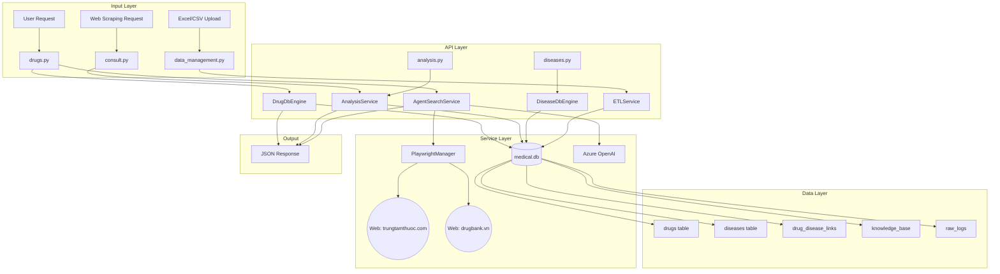
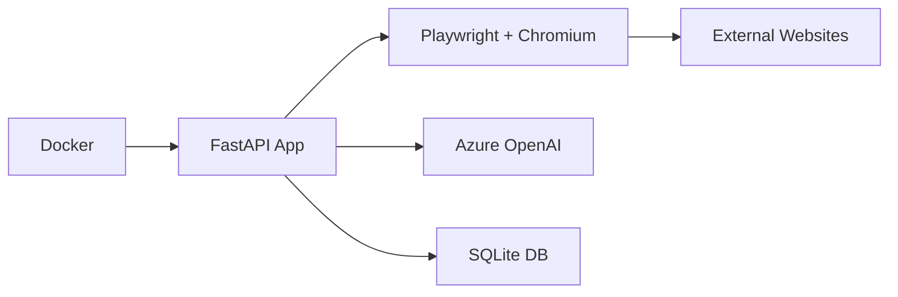

# State Reconstruction - Kiến Trúc Hệ Thống Drug-ICD Mapping

## 1. Tổng quan

Tài liệu này mô tả kiến trúc hệ thống dưới dạng **đồ thị nhân quả (causal graph)** và liệt kê các **bất biến hệ thống (system invariants)** phải được giữ vững.

---

## 2. Đồ thị nhân quả (Causal Graph)



---

## 3. Mô tả các thành phần

### 3.1 API Layer

| File | Chức năng | Endpoints |
|------|-----------|-----------|
| `drugs.py` | CRUD thuốc, agent search | `/drugs`, `/drugs/agent-search` |
| `diseases.py` | CRUD bệnh ICD-10 | `/diseases`, `/diseases/search` |
| `consult.py` | AI phân tích mapping | `/consult/analyze` |
| `analysis.py` | Thống kê, báo cáo | `/analysis/stats` |
| `data_management.py` | ETL, import/export | `/data/ingest`, `/data/export` |
| `admin.py` | Quản trị hệ thống | `/admin/users` |

### 3.2 Service Layer

| Service | File | Chức năng |
|---------|------|-----------|
| AgentSearchService | `agent_search_service.py` | Browser Agent tìm thuốc trên web |
| PlaywrightManager | `playwright_manager.py` | Quản lý browser headless |
| SearchNormalizer | `search_normalizer.py` | Chuẩn hóa tên thuốc cho search |
| ETLService | `etl_service.py` | Extract-Transform-Load dữ liệu |
| WebCrawler | `web_crawler_v2.py` | Scraping dữ liệu thuốc |

### 3.3 Data Layer

| Table | Chức năng | Primary Key |
|-------|-----------|-------------|
| `drugs` | Thông tin thuốc | `id` |
| `diseases` | Bệnh ICD-10 | `icd_code` |
| `drug_disease_links` | Mapping thuốc-bệnh | `id` |
| `knowledge_base` | Kiến thức tích lũy (Vote & Promote) | `id` |
| `raw_logs` | Log dữ liệu thô | `id` |
| `drug_staging` | Thuốc chờ duyệt | `id` |

---

## 4. Bất biến hệ thống (System Invariants)

### 4.1 Bất biến về dữ liệu

| ID | Invariant | Mô tả |
|----|-----------|-------|
| D1 | Tính duy nhất của SDK | Mỗi số đăng ký (SDK) trong `drugs` phải unique |
| D2 | Tính duy nhất của ICD | Mỗi `icd_code` trong `diseases` phải unique |
| D3 | Referential integrity | `drug_disease_links.drug_id` phải tồn tại trong `drugs.id` |
| D4 | Non-null tên thuốc | `drugs.drug_name` không được NULL |
| D5 | Knowledge consistency | `knowledge_base.frequency >= 1` luôn đúng |

### 4.2 Bất biến về API

| ID | Invariant | Mô tả |
|----|-----------|-------|
| A1 | Response format | Mọi API phải trả về JSON với `status` field |
| A2 | Authentication | Admin endpoints yêu cầu auth header |
| A3 | Rate limiting | Agent search giới hạn 10 requests/minute |
| A4 | Error handling | Lỗi phải được wrap trong `{"error": "message"}` |

### 4.3 Bất biến về Agent

| ID | Invariant | Mô tả |
|----|-----------|-------|
| G1 | Max rounds | Agent search tối đa 5 rounds/thuốc |
| G2 | URL normalization | Drug name phải được normalize trước khi search |
| G3 | Detail page detection | Agent phải trả answer khi ở trang chi tiết thuốc |
| G4 | No duplicate URLs | Agent không navigate đến URL đã có trong history |
| G5 | Playwright cleanup | Browser context phải được cleanup sau mỗi request |

### 4.4 Bất biến về hệ thống

| ID | Invariant | Mô tả |
|----|-----------|-------|
| S1 | Docker health | Container phải healthy trước khi nhận request |
| S2 | Database connection | medical.db phải accessible trong container |
| S3 | Azure OpenAI availability | Agent chỉ hoạt động khi Azure endpoint reachable |
| S4 | Chromium flags | Playwright phải launch với `--no-sandbox` trong Docker |

---

## 5. Luồng dữ liệu chính (Data Flow)

### 5.1 Luồng Agent Search

```
User Request → drugs.py → AgentSearchService
    → SearchNormalizer (normalize drug name)
    → PlaywrightManager (navigate to trungtamthuoc.com)
    → Azure OpenAI (analyze DOM, decide action)
    → [Loop max 5 rounds]
        → Navigate OR Extract Answer
    → Return JSON Response
```

### 5.2 Luồng Consult/Analysis

```
Prescription Data → consult.py → DrugDbEngine
    → Search drugs in DB
    → DiseaseDbEngine (search diseases)
    → AnalysisService (AI analysis)
    → KnowledgeBase (Vote & Promote)
    → Return analysis JSON
```

---

## 6. Điểm rủi ro (Risk Points)

| Risk | Mô tả | Mitigation |
|------|-------|------------|
| Website block | trungtamthuoc.com có thể block bot | Fallback sang drugbank.vn, nhathuoclongchau.com |
| Azure quota | Vượt quá quota Azure OpenAI | Rate limiting, caching |
| DB lock | SQLite lock khi concurrent writes | Connection pooling với timeout |
| Memory leak | Playwright không cleanup đúng | Explicit context.close() và browser.close() |

---

## 7. Deployment Dependencies



---

*Last Updated: 2026-01-14*
